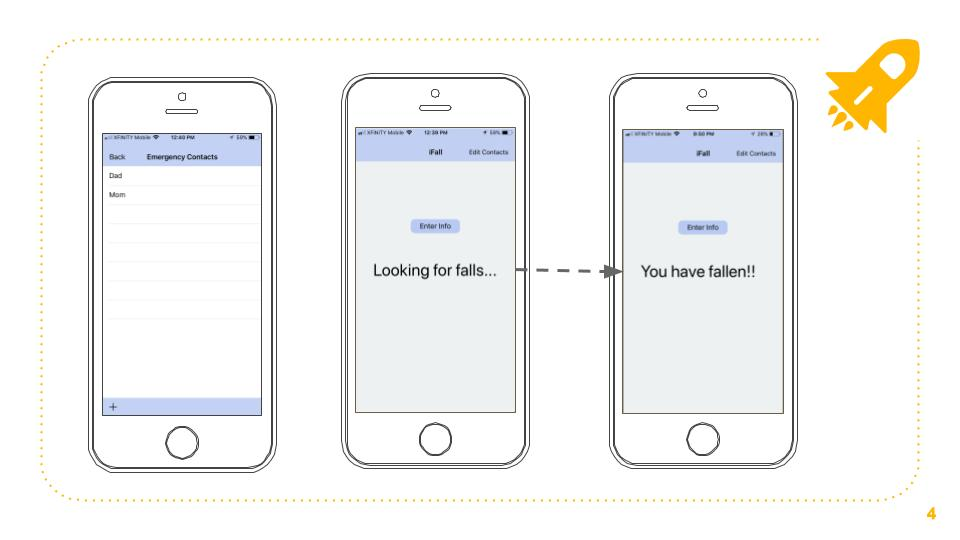
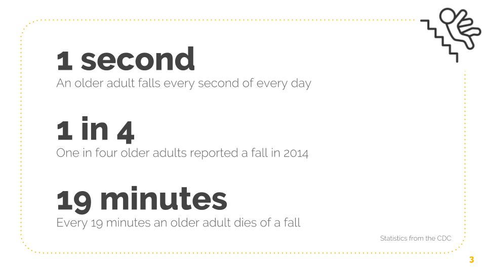

## Get source code at:
`git clone https://github.com/koneman/iFall.git`

# iFall
iFall is an iOS application that is targeted at detecting falls in the older population and notifying emergency contacts to save valuable time for an emergency medical response.

